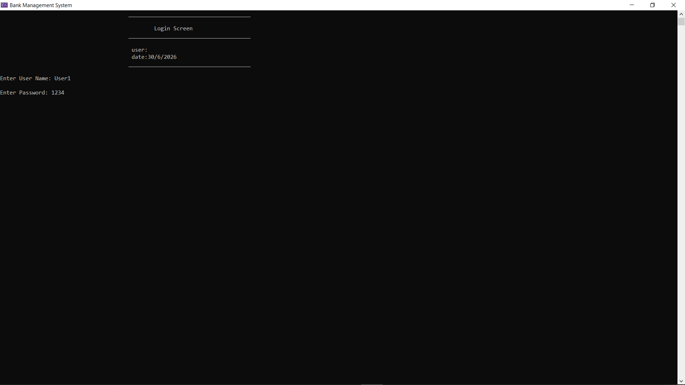
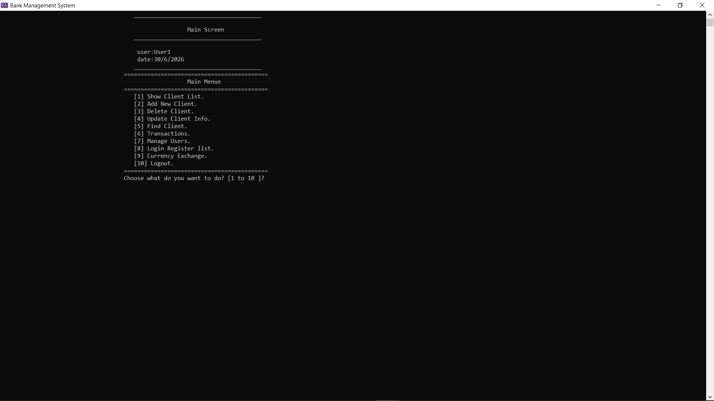
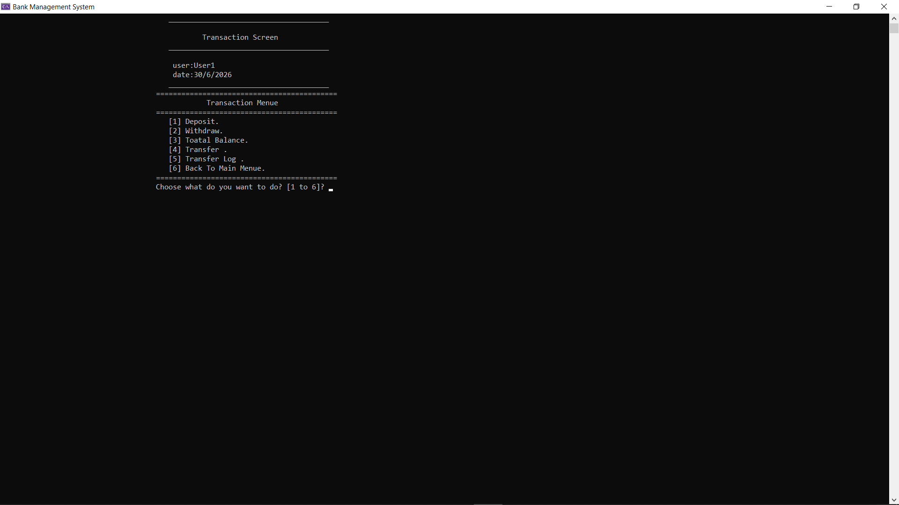
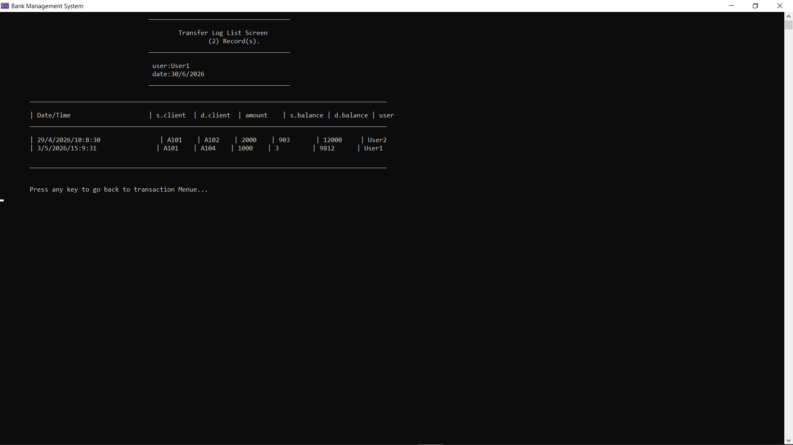
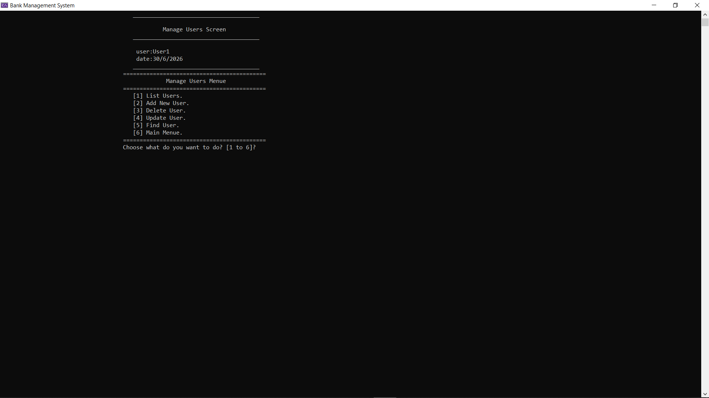
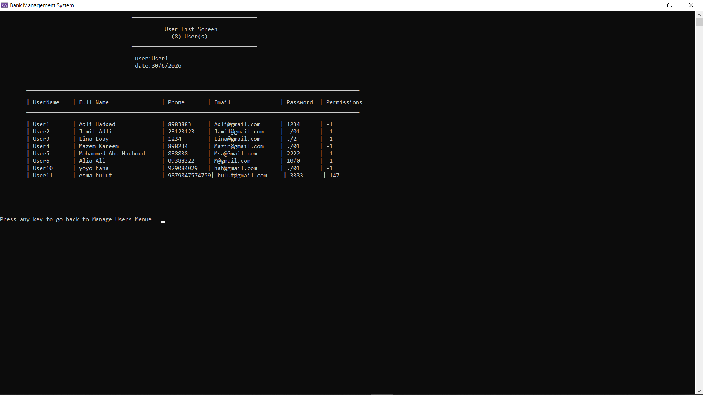
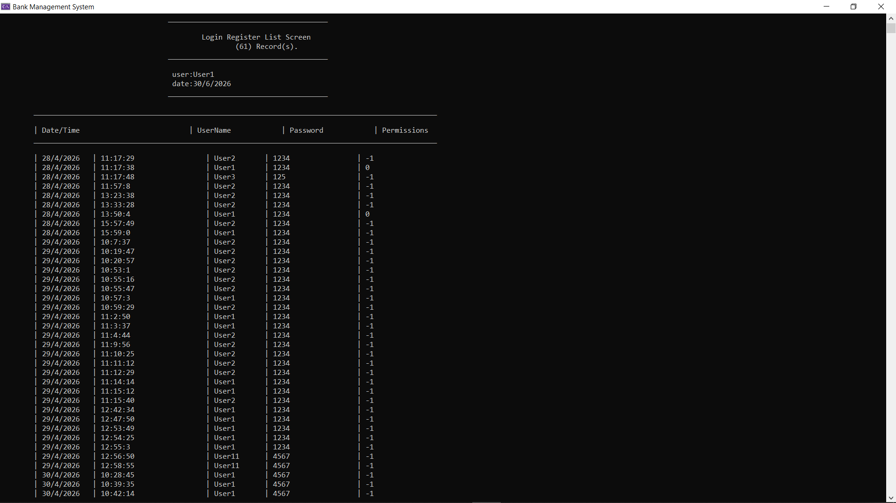
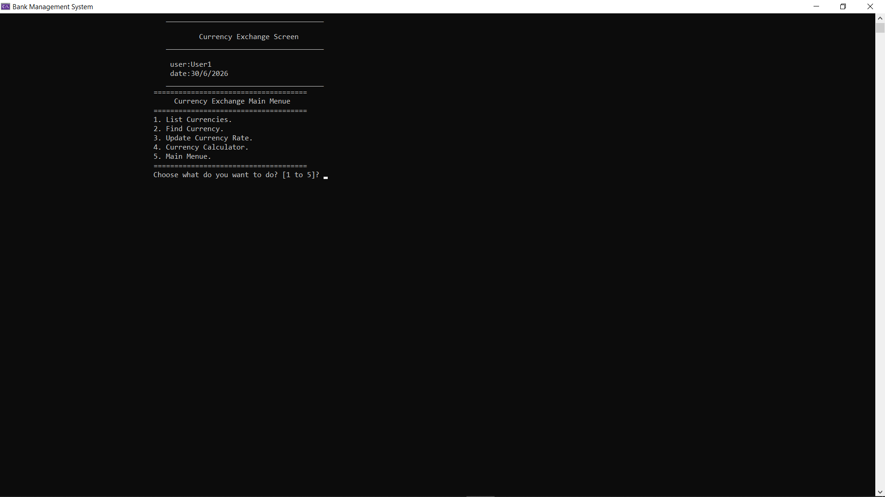
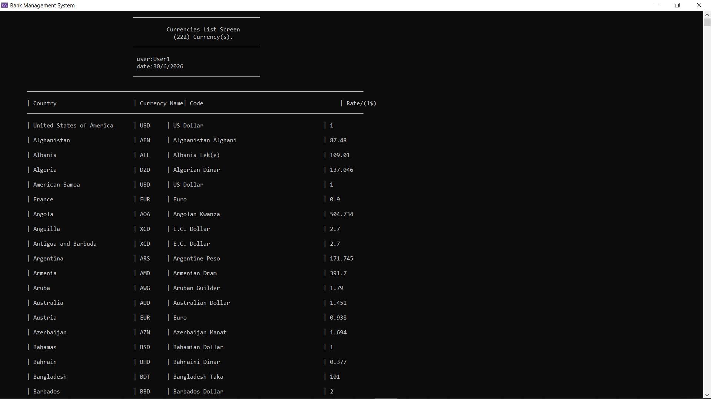

# Bank Management System (C++ / Object-Oriented Programming)

A console-based Bank Management System developed in modern C++ using Object-Oriented Programming (OOP) principles.

This project represents a complete redesign and significant evolution of my previous procedural banking system. Rather than simply rewriting the original implementation, the application was restructured around classes, encapsulation, inheritance, and separation of responsibilities while continuously extending the system with new banking features.

The goal of this project was not only to implement banking operations, but also to practice designing maintainable, modular, and scalable software using object-oriented design principles.

---

# Project Evolution

The project was developed incrementally through multiple iterations.

### Initial Banking System

The first version implemented the core banking functionality:

- Client management
- Add new client
- Update client
- Delete client
- Find client
- List all clients
- Deposit
- Withdraw
- Calculate total balances

After completing the core functionality, the project evolved into a complete banking application by introducing new modules and improving the overall architecture.

---

# Major Enhancements

## User Management

A complete user management subsystem was introduced.

Features include:

- Add users
- Update users
- Delete users
- Search users
- List users

---

## Authentication System

The application was extended with a secure login system.

Features:

- User authentication
- Logout
- Session management
- Logged-in user tracking

---

## Permission-Based Authorization

Each user is assigned a configurable set of permissions.

The system validates permissions before allowing access to protected operations such as:

- Client management
- User management
- Transactions
- Reports
- Currency Exchange
- Login History

---

## User Interface Improvements

Every application screen displays:

- Current date
- Logged-in user

---

## Login Security

Security enhancements include:

- Lock the system after three failed login attempts.
- Encrypt user passwords before storing them.

---

## Login Register

Every successful login is stored in a dedicated log file.

The application provides:

- Login Register screen
- Login history
- Permission-controlled access

---

## Money Transfer System

Transfer functionality includes:

- Client-to-client transfers
- Balance validation
- Secure transaction execution

---

## Transfer Log

Every transfer operation is permanently recorded.

The application includes:

- Transfer history
- Transfer log screen
- Detailed transaction records

---

## Currency Exchange Module

A complete Currency Exchange subsystem was added.

Features:

- List currencies
- Find currency
- Update exchange rates
- Currency calculator
- Currency conversion

Currency information is stored independently from banking data.

---

# Object-Oriented Design

The application was implemented following Object-Oriented Programming principles.

Key concepts include:

- Classes & Objects
- Encapsulation
- Inheritance
- Abstraction
- Interfaces / Abstract Classes
- Composition
- Static Members
- Access Modifiers
- Separation of Responsibilities (SRP)
- Modular Design

Each application screen is implemented as an independent class responsible for a single responsibility, making the project easier to maintain, test, and extend.

---

# Project Structure

The application is organized into reusable modules:

- Banking Core
- User Management
- Authentication
- Authorization
- Currency Exchange
- Validation Library
- Utility Library
- Date Utilities
- String Utilities
- File Management

Business logic is separated from presentation logic and reusable utility components.

---

# Data Persistence

The project uses file-based persistence.

Separate files are maintained for:

- Clients
- Users
- Login Register
- Transfer Log
- Currency Exchange

---

# Technologies

- C++
- Object-Oriented Programming (OOP)
- Standard Template Library (STL)
- File Handling
- Visual Studio

---

# Skills Demonstrated

- Object-Oriented Design
- Software Architecture
- Class Design
- Authentication & Authorization
- File Processing
- Banking System Development
- Modular Software Design
- Console Application Development
- Separation of Responsibilities

---

# Application Screenshots

## Login Screen

---

## Main Menu

---

## Transactions Menu

---

## Transfer Log

---

## Manage Users

---

## Users List

---

## Login Register

---

## Currency Exchange Menu

---

## Currency Calculator

---

# Related Projects

This project is part of my C++ learning journey, where each project builds upon the previous one.

## 🏧 ATM System (Procedural Programming)

A console-based ATM application implementing authentication, withdrawals, deposits, balance inquiries, and transaction operations using procedural programming concepts.

🔗 Repository:

https://github.com/mmoho92-cloud/ATM-System.git

---

## 🏦 Bank Management System (Procedural Programming)

The first implementation of the banking system developed using procedural programming before being completely redesigned using Object-Oriented Programming principles.

🔗 Repository:

https://github.com/mmoho92-cloud/Bank-Management-System.git

---

# Project Timeline

✔️ ATM System (Procedural Programming)

⬇️

✔️ Bank Management System (Procedural Programming)

⬇️

✔️ Bank Management System (Object-Oriented Programming)

⬇️

🚀 Next Version: SQL Database Integration

⬇️

🚀 Future Version: Graphical User Interface (GUI)

⬇️

🚀 Future Version: REST API

---

# Future Improvements

The project will continue to evolve with additional features and architectural improvements, including:

- SQL Database Integration
- Graphical User Interface (GUI)
- REST API
- Unit Testing
- Design Patterns
- Multi-layer Architecture
- Improved Security
- Better Error Handling